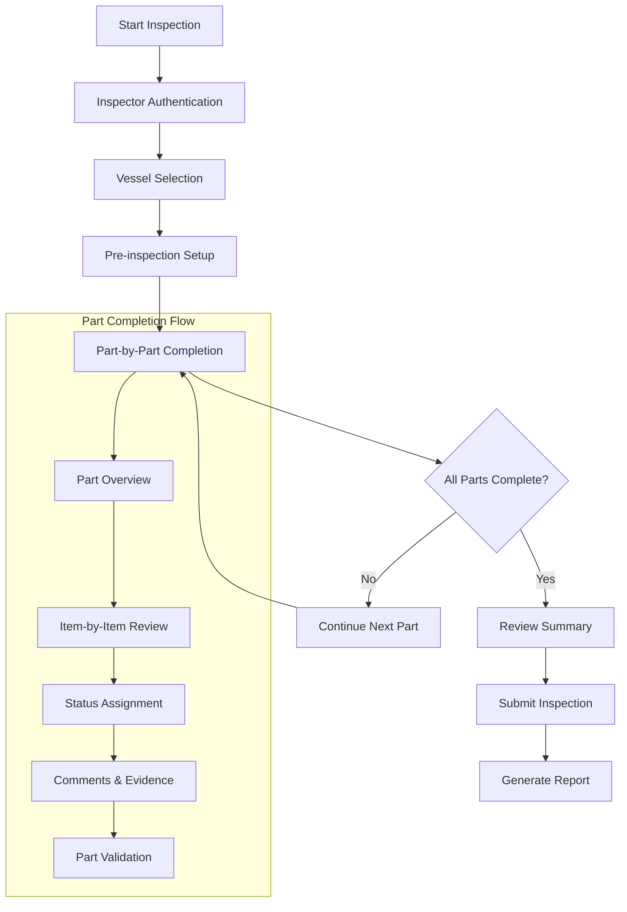
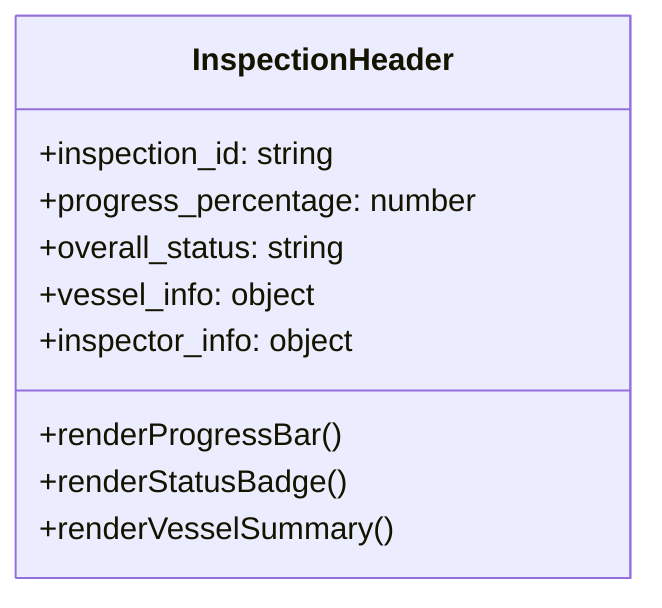
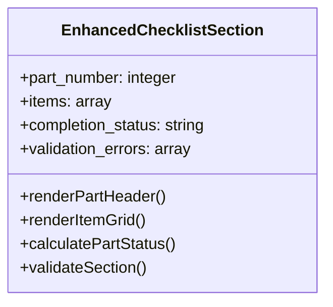
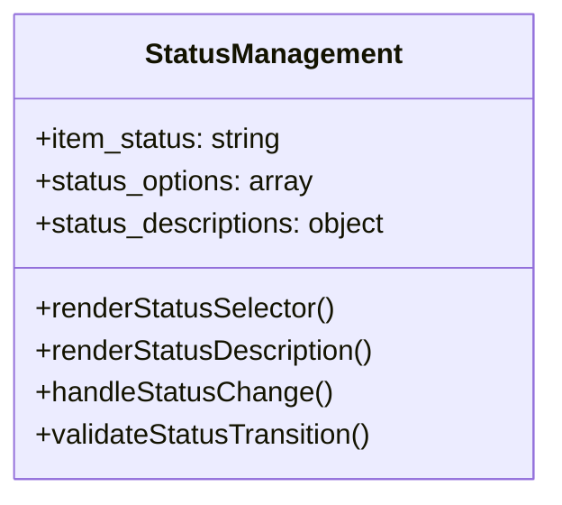
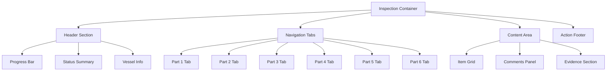
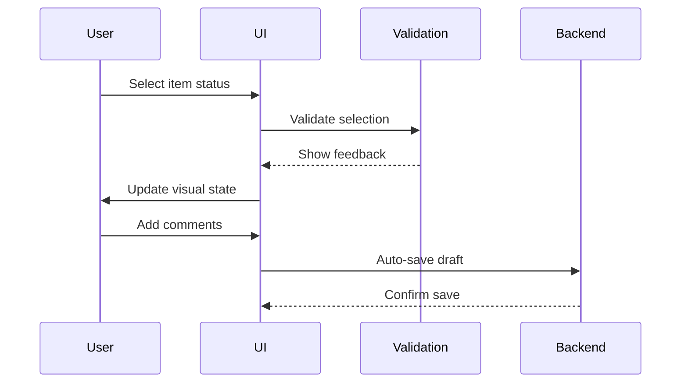
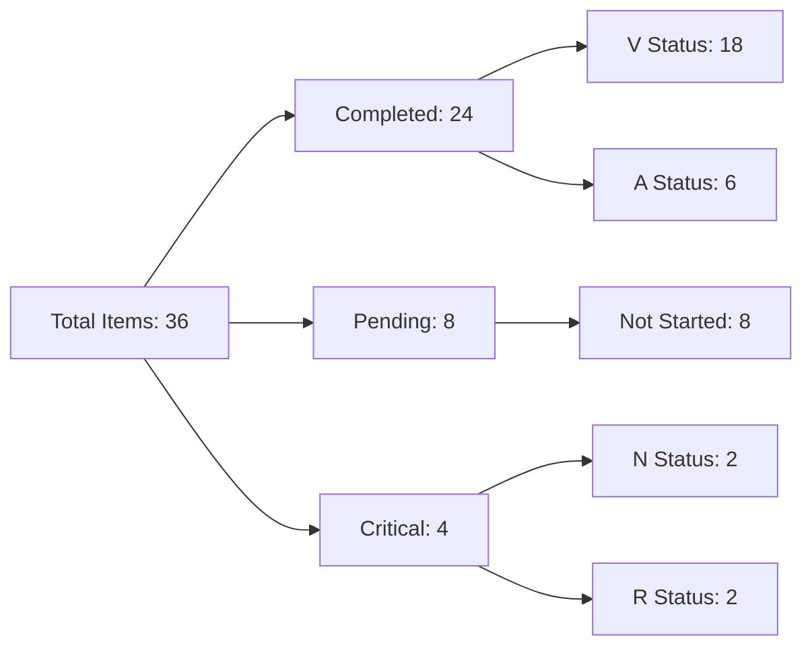
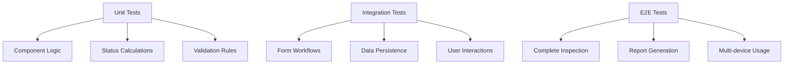

# Checklist Design Enhancement

## Overview

This document outlines the design enhancements for the Novum Checklist Inspection system, focusing on improving user experience, visual design, and interaction patterns. The checklist inspection module is a critical component of the vessel management system that enables comprehensive inspection tracking across six standardized parts with detailed item-level validation.

### Current System Analysis

The existing checklist inspection system provides:
- Six-part inspection structure with 6 items per part (36 total items)
- Status management (V/A/N/R) with automatic overall status calculation
- Vessel association support for multi-vessel inspections
- Inspector information tracking with licensing details
- Integration with Filament admin panel

### Design Objectives

- Enhance visual hierarchy and information presentation
- Improve form completion workflow and user guidance
- Implement progressive disclosure patterns for complex data
- Optimize mobile responsiveness and touch interactions
- Integrate contextual help and validation feedback
- Strengthen status visualization and progress tracking

## Technology Stack & Dependencies

### Frontend Framework
- **Filament v3.x**: Primary admin panel framework
- **Laravel Livewire**: Real-time component interactions
- **Alpine.js**: Client-side reactivity and DOM manipulation
- **Tailwind CSS**: Utility-first styling framework

### Backend Integration
- **Laravel 12.0**: Core framework with Eloquent ORM
- **PHP 8.2**: Server-side processing
- **MySQL**: Data persistence layer

### UI Component Libraries
- **Heroicons**: Consistent iconography system
- **Filament Forms**: Advanced form components
- **Filament Tables**: Data presentation layer

## User Experience Architecture

### Inspection Workflow Design

### Information Architecture

The enhanced design reorganizes information into logical hierarchies:

#### Primary Navigation
1. **Inspection Overview** - Key metrics and progress
2. **Inspector Details** - Authentication and credentials
3. **Vessel Configuration** - Primary and associated vessels
4. **Inspection Parts** - Six-part checklist structure
5. **Summary & Submission** - Final review and validation

#### Progressive Disclosure Pattern
- **Level 1**: High-level inspection status and progress
- **Level 2**: Part-specific completion status
- **Level 3**: Individual item details with evidence
- **Level 4**: Detailed comments and validation notes

## Component Architecture

### Enhanced Form Components

#### 1. InspectionHeader Component

**Features:**
- Real-time progress tracking across all parts
- Visual status indicators with color coding
- Vessel information summary panel
- Inspector credentials display

#### 2. EnhancedChecklistSection Component

**Enhanced Features:**
- Smart grid layout with responsive breakpoints
- Visual completion indicators per item
- Contextual validation with inline feedback
- Bulk actions for similar items
- Evidence attachment capability

#### 3. StatusManagement Component

### Grid System Enhancement

#### Responsive Breakpoint Strategy

| Screen Size | Columns | Item Layout | Interaction Method |
|-------------|---------|-------------|-------------------|
| Mobile (< 640px) | 1 | Stack Layout | Touch-optimized |
| Tablet (640-1024px) | 2-3 | Card Layout | Mixed touch/mouse |
| Desktop (> 1024px) | 4-6 | Grid Layout | Mouse-optimized |
| Large (> 1440px) | 6+ | Enhanced Grid | Multi-monitor |

#### Component Layout Structure

## Visual Design System

### Color Palette & Status Indicators

#### Status Color Mapping
| Status | Color | Hex Code | Usage Context |
|--------|-------|----------|---------------|
| V (Vigente) | Success Green | #10B981 | Compliant items |
| A (En trámite) | Warning Amber | #F59E0B | Minor observations |
| N (Reparaciones) | Warning Orange | #F97316 | Repair needed |
| R (Vencido) | Danger Red | #EF4444 | Critical issues |

#### Visual Hierarchy
- **Primary**: Status indicators and completion badges
- **Secondary**: Navigation elements and section headers
- **Tertiary**: Comments and supporting information
- **Neutral**: Form fields and data containers

### Typography Scale

| Element | Font Size | Weight | Line Height | Usage |
|---------|-----------|--------|-------------|-------|
| Main Title | 2.25rem (36px) | 700 | 1.2 | Page headers |
| Section Title | 1.5rem (24px) | 600 | 1.3 | Part headers |
| Item Label | 1rem (16px) | 500 | 1.4 | Form labels |
| Body Text | 0.875rem (14px) | 400 | 1.5 | Content |
| Caption | 0.75rem (12px) | 400 | 1.4 | Helper text |

### Spacing System

Based on 8px grid system:
- **Micro**: 4px (0.25rem) - Element spacing
- **Small**: 8px (0.5rem) - Component padding
- **Medium**: 16px (1rem) - Section spacing
- **Large**: 24px (1.5rem) - Component margins
- **XLarge**: 32px (2rem) - Layout sections

## Interaction Design Patterns

### Form Completion Patterns

#### 1. Progressive Enhancement

#### 2. Smart Defaults & Auto-completion
- Pre-populate inspector information from session
- Suggest vessel associations based on ownership
- Auto-calculate overall status in real-time
- Carry forward similar items across parts

#### 3. Contextual Help System
- Inline help tooltips for status definitions
- Progressive disclosure of detailed descriptions
- Context-sensitive validation messages
- Visual examples for each status type

### Navigation & Flow Control

#### Tab Navigation Enhancement
- Visual progress indicators on each tab
- Validation state display (complete/incomplete/error)
- Smart tab ordering based on completion status
- Keyboard shortcuts for power users

#### Form State Management
- Auto-save functionality with visual feedback
- Conflict resolution for concurrent editing
- Version history for inspection modifications
- Draft state preservation across sessions

## Data Visualization & Reporting

### Real-time Progress Dashboard

### Status Summary Widgets
- Completion percentage with animated progress bars
- Status distribution pie charts
- Part-by-part completion matrix
- Historical trend comparison

### Export & Reporting Features
- PDF generation with branded templates
- Excel export with detailed item breakdown
- Custom report templates for different stakeholders
- Automated distribution to relevant parties

## Mobile-First Responsive Design

### Breakpoint Strategy

#### Mobile (320px - 767px)
- Single column layout with stacked components
- Touch-optimized input controls (44px minimum)
- Collapsible sections for space efficiency
- Swipe gestures for part navigation

#### Tablet (768px - 1023px)
- Two-column layout for form and preview
- Hybrid touch/mouse interaction support
- Side panel navigation with part overview
- Optimized for portrait and landscape orientations

#### Desktop (1024px+)
- Multi-column grid with sidebar navigation
- Keyboard shortcuts and power user features
- Inline editing with immediate feedback
- Advanced filtering and search capabilities

### Touch Interaction Guidelines
- Minimum 44px touch targets
- Visual feedback for all interactions
- Gesture support (swipe, pinch, long-press)
- Accessibility compliance (WCAG 2.1 AA)

## Performance & Optimization

### Frontend Performance
- Lazy loading for large checklists
- Virtual scrolling for extensive item lists
- Progressive image loading for evidence
- Client-side caching for form state

### Backend Optimization
- Database indexing for search queries
- Eager loading for related models
- Caching layer for static data
- Background processing for reports

### Loading States & Feedback
- Skeleton screens during data loading
- Progress indicators for long operations
- Error boundaries with recovery options
- Offline support with sync capabilities

## Accessibility & Inclusion

### WCAG 2.1 Compliance
- Keyboard navigation support
- Screen reader compatibility
- Color contrast ratios (4.5:1 minimum)
- Focus management and visual indicators

### Internationalization Support
- Multi-language interface support
- RTL layout compatibility
- Cultural date/time formatting
- Localized status descriptions

### User Assistance Features
- Contextual help system
- Video tutorials for complex workflows
- Progressive disclosure of advanced features
- Error prevention and recovery guidance

## Testing Strategy

### Component Testing

### Browser Testing Matrix
| Browser | Desktop | Mobile | Tablet |
|---------|---------|---------|---------|
| Chrome | ✓ | ✓ | ✓ |
| Firefox | ✓ | ✓ | ✓ |
| Safari | ✓ | ✓ | ✓ |
| Edge | ✓ | - | ✓ |

### Performance Testing
- Load testing with concurrent users
- Response time benchmarks
- Memory usage profiling
- Network optimization validation